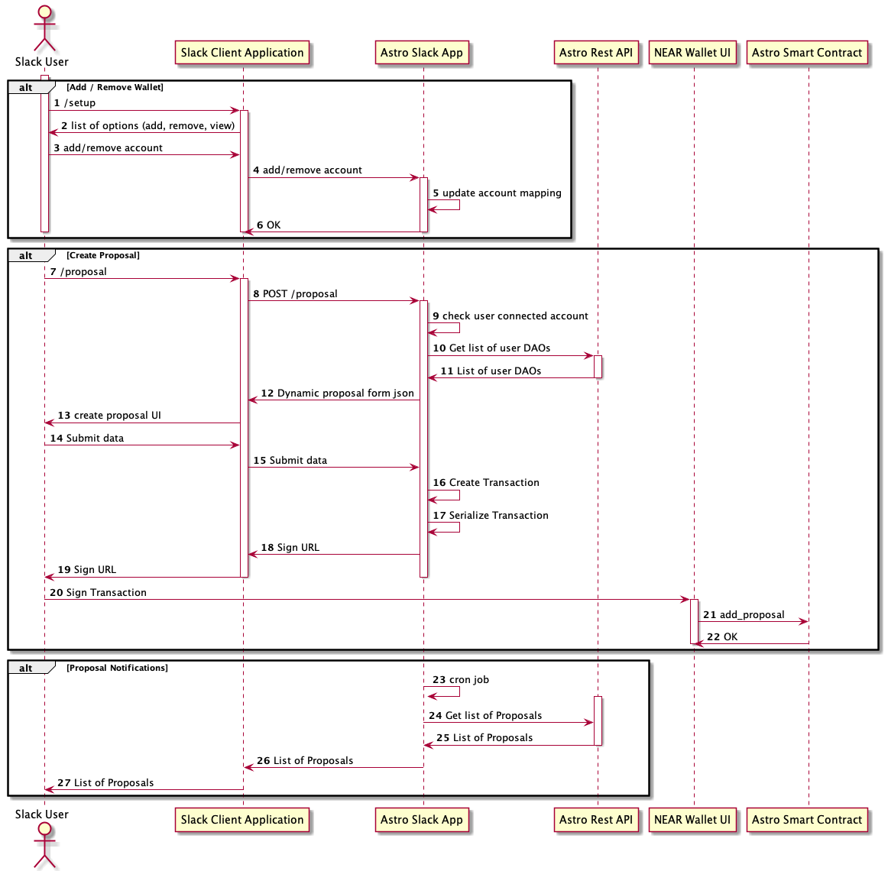

# Slack App that integrates with Astro smart contract for DAOs

This is a submission for the DAO Global Hackathon [Bounty](https://gitcoin.co/issue/near/bounties/72/100026971)

[NEAR Blog](https://near.org/blog/astro-launches-on-near-to-supercharge-dao-communities/) on Astro initiative. 

## App Features

* Connect a wallet
* Create proposals (Transfer, Bounty, Add Member, Remove Member)
* Get proposals updates in Slack channel
* Vote on proposals 
* Query the DAO Treasury balance

## Design Highlights

Users' private keys are never stored within the app. Each and every transaction must be signed via the [Wallet](wallet.near.org/).

## Sequence diagram



## Configuration

`.evn` file should be created in the root folder, with the following variables:

```
ASTRO_API=https://api.testnet.app.astrodao.com/api/v1
ASTRO_APP=https://api.testnet.app.astrodao.com
SLACK_HOOK=<HOOK>
APP_CLIENT_ID=<Client ID>
APP_SHARED_SECRET=<Shared Secret>
BOT_TOKEN=<Bot Token>
```